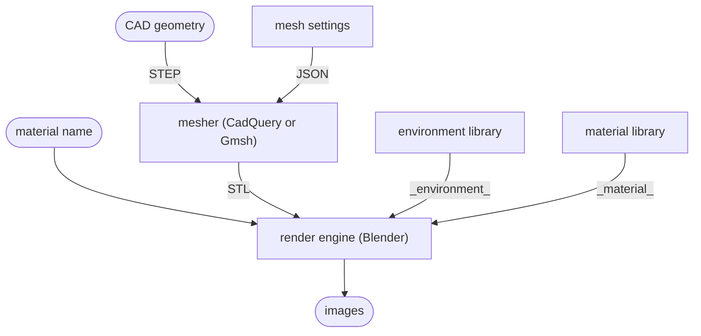

# ETHZ Semester Project - vhirsch

`updated: 27.11.2025`

## TODO

- test Gmsh
- CadQuery vs Gmsh
- experiment with mesh settings for CadQuery and Gmsh
- how to check STEPs for materials OR should this not be an option -> if material defined, what does this look like, can this even be used?
- how to describe materials (MTL or blend)
- build material library (open source libraries?)
- what should an environment include (background, atmospheric conditions, object placement, camera positions)
- how to create and save environments
- build environment library
- automate image generation in Blender
  - set-up
    - environment
    - object placement
    - material
    - lighting
    - camera
  - rendering
- ...

## Input

From the user:

- object
  - CAD geometry (STEP)
  - material name
- (output size int, default=?)
- (configuration JSON, default=all)

Programme internal:

- mesh settings (JSON)
- material library
- environment library
- camera settings
- lighting settings

## Pipeline

## Architecture

Implementation possibilities:

- Blender add-on/script
- Python script (TODO can this call and control Blender?)

## oof

Input: CAD geometry of an object
Output: set of photorealistic images of the object

## Links

- [`nut.STEP`](https://www.mcmaster.com/94223A105/)
- [Material Pack Wood - 03](https://juliosillet.gumroad.com/l/Dvdll)

## Notes

`<file:end>`
